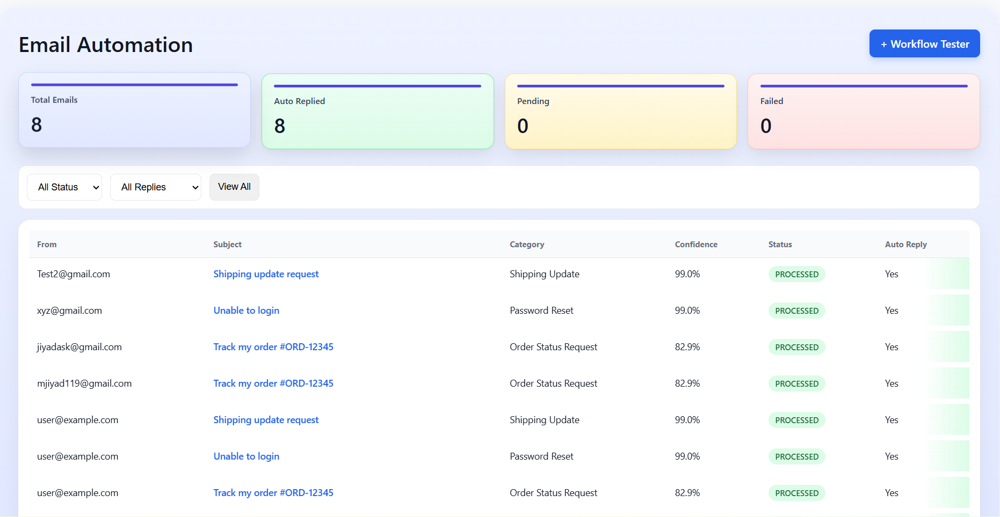
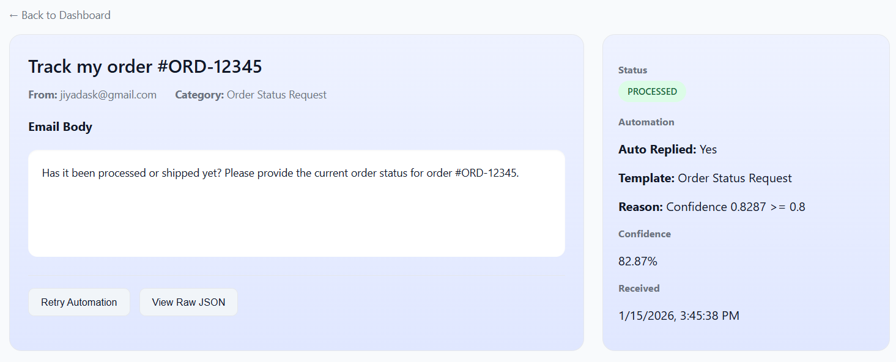
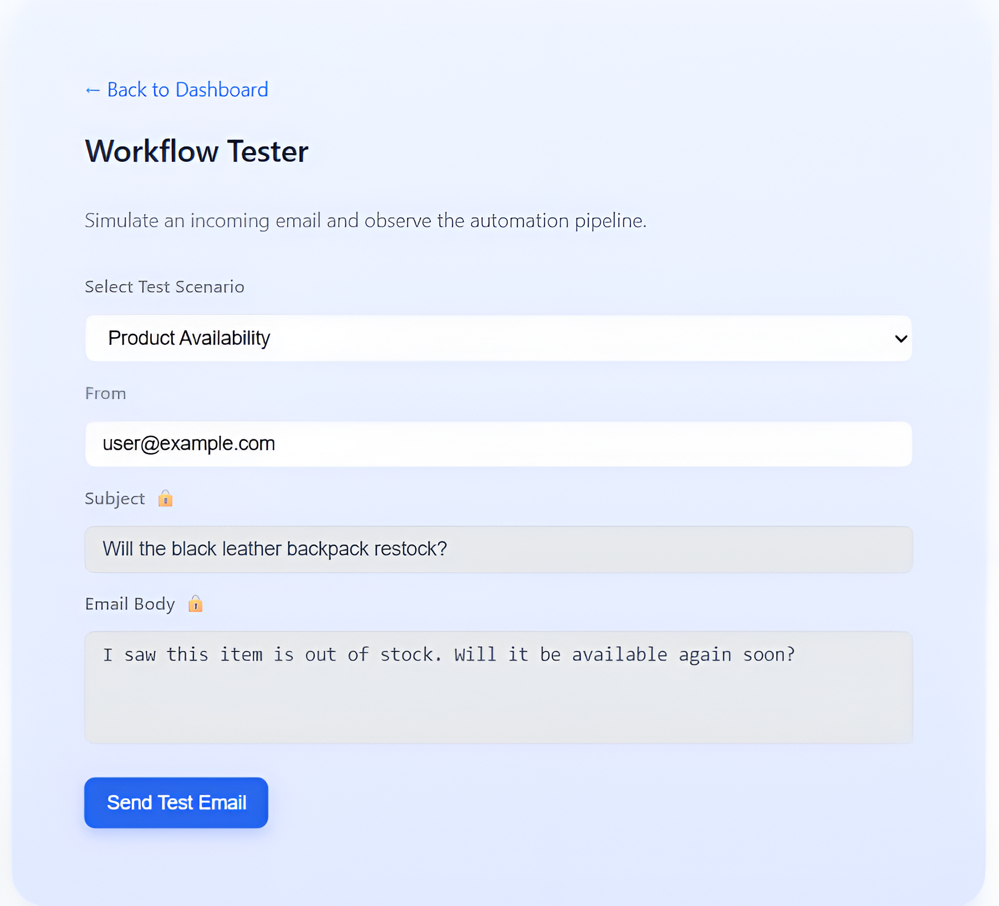

# 📧 Email Automation Platform

An event-driven, scalable email automation system that ingests incoming emails, processes them asynchronously, classifies them using a machine-learning service, and automatically responds based on confidence thresholds — with real-time visibility via a live dashboard.

---

## 🚩 Problem Statement

As email volume increases, synchronous processing quickly becomes a bottleneck.  
Traditional systems suffer from:

- High response latency
- Duplicate email handling
- Tight coupling between ingestion and processing
- Poor scalability and observability
- Limited support for intelligent automation

This project addresses these challenges by designing an **asynchronous, decoupled pipeline** with ML-powered decision-making and real-time system feedback.

---

## 🧠 Solution Overview

The system follows an **event-driven architecture**:

- Emails are ingested via a lightweight webhook API
- Messages are stored idempotently to avoid duplicates
- Processing is delegated to background workers
- Classification is handled by an isolated ML service (BERT)
- Confidence thresholds determine safe auto-replies
- Delivery results are tracked and failures routed to a DLQ
- Live updates are pushed to the frontend via WebSockets

This design enables **scalability, fault isolation, intelligent automation, and real-time observability**.

---

## 🖥️ Live Dashboard

The frontend provides **real-time visibility** into the entire automation pipeline.

**Key capabilities:**

- Live email updates via WebSockets

- Stats overview:

  - Total emails

  - Auto-replied emails

  - Pending deliveries

  - Failed deliveries

- Filter by:

  - Processing status (QUEUED, PROCESSED)

  - Auto-reply state

- Infinite scrolling for large datasets

- Detailed email view with:

  - Classification result

  - Confidence score

  - Auto-reply reasoning

  - Delivery status

### 📸 UI Screenshots

#### Dashboard

<p align="center">
  
</p>

#### Email Details View

<p align="center">
  
</p>

#### Workflow Tester

<p align="center">
  
</p>

## 🏗️ System Architecture

```
Email Provider / Webhook
↓
Node.js Ingestion API
↓
MongoDB (Idempotent Storage)
↓
Redis + BullMQ (Queue)
↓
Background Worker
├─ ML Classification Service (BERT + Rules)
├─ Confidence Evaluation
├─ Auto-Reply Policy Check
├─ SMTP Email Delivery
└─ Dead Letter Queue (Failures)
↓
MongoDB (Final State)
↓
MongoDB Change Stream
↓
WebSocket Server
↓
React Dashboard (Live Updates)
```

### Key Design Principles

- Asynchronous processing
- Idempotent ingestion
- Separation of concerns
- ML isolation via HTTP service
- Confidence-based automation
- Event-driven UI updates

---

## ⚙️ Tech Stack

### Backend & Infrastructure

- Node.js, Express
- MongoDB Atlas
- Redis, BullMQ
- Socket.IO
- Nodemailer (SMTP)
- Docker (Redis)
- dotenv

### Machine Learning

- Python, FastAPI
- HuggingFace Transformers
- BERT-based email classification
- Hybrid ML + rule-based logic
- Confidence scoring & calibration

### Frontend

- React (Vite)
- Infinite scrolling dashboard
- Filters & detailed views
- WebSocket-based live updates

### Tooling

- Git, GitHub
- Postman
- MongoDB Compass

---

## 📂 Project Structure

```text
Email-Automation/
├── backend/
│   ├── src/
│   │   ├── app.js
│   │   ├── server.js
│   │   ├── socket.js
│   │   ├── routes.js
│   │   ├── config/
│   │   │   └── redis.js
│   │   └── modules/
│   │       ├── ingestion/
│   │       ├── emails/
│   │       ├── worker/
│   │       ├── replies/
│   │       ├── queue/
│   │       └── stats/
│   ├── .env
│   └── package.json
│
├── ml/
│   ├── api.py                     # FastAPI entry point
│   ├── predictor.py               # Prediction orchestration
│   ├── classifier.py              # BERT inference
│   ├── rules.py                   # Rule-based overrides
│   ├── confidence.py              # Confidence calibration
│   └── model/
│       ├── email_bert_model/       # Trained BERT model artifacts
│       └── labels.json             # Label ↔ index mapping
│
├── frontend/
│   ├── src/
│   │   ├── pages/
│   │   ├── components/
│   │   ├── hooks/
│   │   └── main.jsx
│   └── vite.config.js
│
└── README.md

```

### 🔁 Email Processing Flow

1. Email is received via webhook ingestion API

2. Email is stored idempotently in MongoDB

3. Email ID is queued using Redis + BullMQ

4. Background worker consumes the job

5. Worker calls ML service for classification

6. Category & confidence are returned

7. Auto-reply policy is evaluated

8. Email is sent via SMTP if confidence threshold passes

9. Delivery status is updated (PENDING, SENT, FAILED)

10. MongoDB change stream emits live update

11. Frontend dashboard updates in real time

## 📦 Sample Email Document

```json
{
  "messageId": "test-msg-006",
  "status": "PROCESSED",
  "category": "Product Availability",
  "confidence": 0.9926,
  "classifiedBy": "BERT",
  "autoReplied": true,
  "deliveryStatus": "SENT"
}
```

## 🚧 Project Status

**Core system complete and functional**, including:

- Backend ingestion & workers

- ML classification pipeline

- Auto-reply automation

- SMTP delivery

- Live dashboard with WebSockets

## 🎯 Why This Project Matters

This project demonstrates real-world backend engineering concepts including
asynchronous processing, ML integration, fault tolerance, and real-time system observability.
